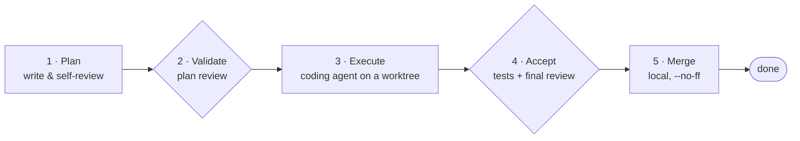

# Getting started

A gentle, ~10-minute walkthrough of `crosscut` on **your own repo** — no sample
project, no multi-repo setup. Just: register the repo you already have, run
`/crosscut`, and watch one small change go from idea to merged commit.

Every plan `crosscut` drives moves through the same five-step track:



## What you'll end up with

By the end of this walkthrough you'll have driven **one real change** in your
own repo through the whole track: a plan that was written and self-reviewed,
validated by a second opinion, implemented on a side branch, checked by tests
and a final review, and merged locally into your integration branch —
`--no-ff`, nothing pushed anywhere. One merged commit, with the paper trail to
show how it got there.

## Prerequisites

All you need to start:

- **Claude Code** (any recent version).
- **Python 3** with **PyYAML** — `pip install pyyaml` (used to read the
  config file).

That covers planning, acceptance, and merging. The executor (the coding agent
that writes code for you in step 3) has its own requirements depending on
which kind you pick — the dependency-light `claude` kind needs neither Docker
nor a CLI, while `ralphex` needs Docker and a completed `claude /login` on the
host (credentials are read from the host before each run), and `codex` needs
the `codex` CLI. If none of that is set up yet, that's fine: `/crosscut init`
will ask, and if the executor you picked can't run when the time comes, driving
a plan still produces the plan and hands it to you to implement instead (a
*manual-run*) — more on that in the safety note below.

## Install

**As a Claude Code plugin:** add this repository as a plugin source and
install it with the `/plugin` command inside a Claude Code session. (Check
Claude Code's own docs for the exact `/plugin` subcommands your version
uses.)

**Manually, with a symlink:**

```bash
git clone <this-repo-url> ~/path/to/crosscut
ln -s ~/path/to/crosscut/skills/crosscut ~/.claude/skills/crosscut
```

Claude Code looks for skills in `~/.claude/skills/`. The symlink keeps the
skill in sync with your clone, so there's no separate copy to update.

## Register your repo

`cd` into the repo you want `crosscut` to manage and run:

```bash
cd ~/code/your-repo
/crosscut init
```

This starts an interview, one question at a time. The **first time** you ever
run `init` (no config exists yet) it also asks a handful of global questions —
your language, which executor and plan-review kind you want by default, and
your git-safety preferences (whether to fast-forward or `--no-ff` merge,
whether to ever push). Every run — first or not — then asks about the
**current repo**: which **product** it belongs to (a lone repo defaults to
being its own product), its **kind** (language/tooling), and its
**test and lint commands**.

This step only **writes config** — it doesn't touch your code or your git
history. Everything lands in one file, `~/.crosscut/crosscut.config.yaml`,
shared across every repo you register.

## Run it

From anywhere, start a session and run:

```
/crosscut
```

`crosscut` validates your config, **reconciles** — it re-derives the true
status of every plan from git history and past run records, so what you see
is never stale — and then shows you a per-product summary: what's done, what's
ready to work on, what's blocked. Then it **waits for you**. It does not pick
a plan on its own and does not start writing code yet — you choose: drive an
existing plan, or ask it to write a new one for a change you describe.

## Drive a plan to done

Once you pick or describe a plan, `crosscut` drives it through all five steps
on its own, only stopping to ask you something at a real architecture decision
or a genuine blocker. In plain English, here's what happens at each step:

1. **Plan.** Claude writes a detailed implementation plan into your repo,
   then reviews and tightens its own draft before moving on.
2. **Validate.** A second opinion — a separate model or tool — reads the plan
   and checks it over. It only reads; it never changes anything. (You can set
   this to `none` if you'd rather skip it.)
3. **Execute.** A coding agent implements the plan in an isolated git
   *worktree* on its own branch — never on the files you have checked out.
4. **Accept.** Your configured lint and test commands run, and a final
   review checks the actual code and design, not just a green test run.
5. **Merge.** The branch is merged locally into your integration branch
   (`--no-ff` by default) and the plan is filed as done.

Expect it to pause for you only when something genuinely needs a human call —
an ambiguous design fork, a failing test it can't resolve on its own, and the
like. Everything else — including the merge itself — happens automatically
once its preconditions are met.

## Where things land

The plan file itself lives under `docs/plans/` in your repo, and moves to
`docs/plans/completed/` once the work is merged (or `docs/plans/rejected/` if
it's abandoned). Separately, each **product** has its own **knowledge base** —
a durable record of the decisions, architecture notes, research, and
incidents that came out of the work, written in plain, Obsidian-compatible
markdown. The plan file is about *one change*; the knowledge base is the
accumulating memory of *why things are the way they are*, and it's always on.

## Concepts in 60 seconds

- **worktree** — a throwaway checkout on a side branch where code is written;
  your working files are untouched.
- **product** — the integration boundary; one or more repos. Status and
  readiness are computed per product.
- **executor** — the coding agent that writes the code (`claude` in-session /
  `ralphex` Docker / `codex` CLI); if it can't run, you implement the plan
  yourself (manual-run).
- **plan review vs final review** — plan review checks the **plan** before
  code; final review checks the **code** before merge.
- **reconcile** — on every `/crosscut` start, it re-derives each plan's true
  status from git + run records.

## Is it safe?

`crosscut` only ever writes code on an isolated side branch or worktree —
never on your live files — and it never pushes anywhere unless you've
explicitly set `git.push_enabled: true`. Commits it makes never carry a
`Co-Authored-By` line. Merges happen locally, `--no-ff` by default. The
executor **always runs the kind you configured** — it is not an optional
add-on step and there's no switch to turn it off — and if that kind can't run in your
environment, driving a plan falls back to a *manual-run*: it hands you the
plan to implement yourself, rather than silently skipping the step.

## Next: going multi-repo

Everything above covers a single repo. Once you're ready to coordinate a
feature that spans more than one repo under the same product, see the worked
example at [`docs/examples/two-repo-python-node/`](examples/two-repo-python-node/).
